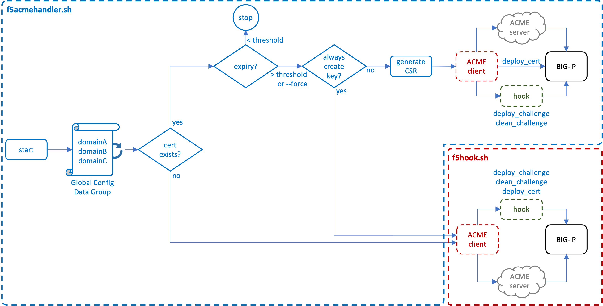

# ACME Certificate Renewal Utility for F5 BIG-IP

### An ACMEv2 client wrapper function for integration and advanced features on the F5 BIG-IP

### DRAFT: In Development

This utility defines a wrapper for the Bash-based [Dehydrated](https://github.com/dehydrated-io/dehydrated) ACMEv2 client, supporting direct integration with F5 BIG-IP, and including additional advanced features:

* Simple installation, configuration, and scheduling
* Supports renewal with existing private keys to enable certificate automation in HSM/FIPS environments
* Supports per-domain configurations, and multiple ACME providers
* Supports External Account Binding (EAB)
* Supports OCSP and periodic revocation testing
* Supports explicit proxy egress
* Supports SAN certificate renewal
* Supports scheduling
* Supports debug logging

<br />

------------
### ${\textbf{\color{blue}Installation\ and\ Configuration}}$
Installation to the BIG-IP is simple. The only constraint is that the certificate objects installed on the BIG-IP **must** be named after the certificate subject name. For example, if the certificate subject name is ```www.foo.com```, then the installed certificate and key must also be named ```www.foo.com```. Certificate automation is predicated on this naming construct. 

<br />

* ${\large{\textbf{\color{red}Step\ 1}}}$ (Install): SSH to the BIG-IP shell and run the following command. This will install all required components.

    ```bash
    curl -s https://raw.githubusercontent.com/kevingstewart/f5acmehandler-bash/main/install.sh | bash
    ```

* ${\large{\textbf{\color{red}Step\ 2}}}$ (Global Config): Update the new ```dg_acme_config``` data group and add entries for each managed domain (certificate subject). See the **Global 
Configuration Options** section below for additional details. Examples:

    ```lua
    www.foo.com := --ca https://acme-v02.api.letsencrypt.org/directory
    www.bar.com := --ca https://acme.zerossl.com/v2/DV90 --config /shared/acme/config_www_example_com
    www.baz.com := --ca https://acme.locallab.com:9000/directory -a rsa
    ```

* ${\large{\textbf{\color{red}Step\ 3}}}$ (Client Config): Adjust the client configuration ```config``` file in the /shared/acme folder as needed for your environment. In most cases you'll only need a single client config file, but this utility allows for per-domain configurations. For example, you can define separate config files when EAB is needed for some provider(s), but not others. See the **ACME Client Configuration Options** section below for additional details.

* ${\large{\textbf{\color{red}Step\ 4}}}$ (HTTP VIPs): Minimally ensure that an HTTP virtual server exists on the BIG-IP that matches the DNS resolution of each target domain (certificate subject). Attach the ```acme_handler_rule``` iRule to each HTTP virtual server.

* ${\large{\textbf{\color{red}Step\ 5}}}$ (Fetch):  Initiate an ACME fetch. This command will loop through the ```dg_acme_config``` data group and perform required ACME certificate renewal operations for each configured domain. By default, if no certificate and key exists, ACME renewal will generate a new certificate and key. If a private key exists, a CSR is generated from the existing key to renew the certificate only. This it to support HSM/FIPS environments, but can be disabled. See the **Utility Command Line Options** and **ACME Client Configuration Options** sections below for additional details.

    ```bash
    cd /shared/acme
    ./f5acmehandler.sh
    ```

* ${\large{\textbf{\color{red}Step\ 6}}}$ (Schedule):  Once all configuration updates have been made and the utility function is working as desired, define scheduling to automate the process. By default, each domain (certificate) is checked against the defined threshold (default: 30 days) and only continues if the threshold is exceeded. See the **Scheduling** section below for additional details. For example, to set a weekly schedule, to initiate an update check **every Monday at 4am**:

    ```
    cd /shared/acme
    ./f5acmehandler.sh --schedule "00 04 * * 1"
    ```

<br />

------------
### ${\textbf{\color{blue}Configuration\ Details}}$
Configuration options for this utility are found in the following locations:

<details>
<summary><b>Global Configuration Options</b> define the set of domains that are to be handled, the designated ACME provider, and optional unique local configuration settings. This list is maintained in a BIG-IP data group (dg_acme_config)</summary>

<br />

Global configuration options are specified in the ```dg_acme_config``` data group for each domain (certificate subject). Each entry in the data group must include a **String**: the domain name (ex. www.foo.com), and a **Value** consisting of a number of configuration options:

<br />

| **Value Options** | **Description**                                 | **Examples**                                                                       | **Required**|
|-------------------|-------------------------------------------------|------------------------------------------------------------------------------------|-------------|
| --ca              | Defines the ACME provider URL                   | --ca https://acme-v02.api.letsencrypt.org/directory           (Let's Encrypt)<br />--ca https://acme-staging-v02.api.letsencrypt.org/directory   (LE Staging)<br />--ca https://acme.zerossl.com/v2/DV90                         (ZeroSSL)<br />--ca https://api.buypass.com/acme/directory                   (Buypass)<br />--ca https://api.test4.buypass.no/acme/directory              (Buypass Test)       |     $${\large{\textbf{\color{red}Yes}}}$$     |
| --config          | Defines an alternate config file<br />(default /shared/acme/config)                | --config /shared/acme/config_www_foo_com                                        |     $${\large{\textbf{\color{black}No}}}$$      |
| -a                | Overrides the required leaf certificate<br />algorithm specified in the config file.<br />Options:<br /><br />- rsa<br />- prime256v1<br />- secp384r1         | -a rsa<br />-a prime256v1<br />-a secp384r1                                                                             |     $${\large{\textbf{\color{black}No}}}$$      |   

<br />

Examples:

```lua
www.foo.com := --ca https://acme-v02.api.letsencrypt.org/directory
www.bar.com := --ca https://acme.zerossl.com/v2/DV90 --config /shared/acme/config_www_example_com
www.baz.com := --ca https://acme.locallab.com:9000/directory -a rsa
```

</details>

<details>
<summary><b>ACME Client Configuration Options</b> define the per-domain ACME client attributes. These settings are maintained in a config text file stored in the "/shared/acme" folder on the BIG-IP.</summary>

<br />

Within the ```/shared/acme/config``` file are a number of additional client attributes. This utility allows for per-domain configurations, for example, when EAB is needed for some providers, but not others. Adjust the following atttributes as required for your Acme provider(s).

| **Config Options**    | **Description**                                                                                                                                 |
|-----------------------|-------------------------------------------------------------------------------------------------------------------------------------------------|
| CURL_OPTS             | Defines specific attributes used in the underlying Curl functions. This could minimally<br />include:<br /><br />--http1.1          = use HTTP/1.1<br />-k                 = ignore certificate errors<br />-x \<proxy-url\>     = use an explicit proxy                                                         |
| KEY_ALGO              | Defines the required leaf certificate algorithm (rsa, prime256v1, or secp384r1)                                                                 |
| KEYSIZE               | Defines the required leaf certificate key size (default: 4096)                                                                                  |
| CONTACT_EMAIL         | Defines the registration account name and must be unique per provider requirements                                                              |
| OCSP_MUST_STAPLE      | Option to add CSR-flag indicating OCSP stapling to be mandatory (default: no)                                                                   |
| THRESHOLD             | Threshold in days when a certificate must be renewed (default: 30 days)                                                                         |
| ALWAYS_GENERATE_KEY   | Set to true to always generate a private key. Otherwise a CSR is created from an existing key to support HSM/FIPS environments (default: false) |
| CHECK_REVOCATION      | Set to true to attempt OCSP revocation check on existing certificates (default: false)                                                          |
| ERRORLOG              | Set to true to generate error logging (default: true)                                                                                           |
| DEBUGLOG              | Set to true to generate debug logging (default: false)                                                                                          |
| RENEW_DAYS            | Minimum days before expiration to automatically renew certificate (default: 30)                                                                 |
| OCSP_FETCH            | Fetch OCSP responses (default: no)                                                                                                              |
| OCSP_DAYS             | OCSP refresh interval (default: 5 days)                                                                                                         |
| EAB_KID/EAB_HMAC_KEY  | Extended Account Binding (EAB) support                                                                                                          |
| FULLCHAIN             | Set to true to install the complete certificate chain, or false to only install the leaf certificate (default: true)                            |
| ZEROCYLE              | Set to preferred number of zeroization cycles for shredding created private keys (default: 3 cycles)                                            |
| CREATEPROFILE         | Set to true to generate new client SSL profiles with new certs/keys (default: false)                                                            |
</details>

<details>
<summary><b>Utility Command Line Options</b> are command line arguments for the f5acmehandler.sh script used in maintenance operations.</summary>

<br />

The ```f5acmehandler.sh``` utility script also supports a set of commandline options for general maintenance usage. When no command options are specified, the utility loops through the ```dg_acme_config``` data group and performs required ACME certificate renewal operations for each configured domain.

| **Command Line Arguments**    | **Description**                                                                                  |
|-------------------------------|--------------------------------------------------------------------------------------------------|
| --force                       | Overrides the default certificate renewal threshhold check (default 30 days)                     |
| --domain [domain]             | Performs ACME renewal functions for a single specified domain. Can be combined with --force<br />Examples:<br />--domain www.foo.com<br />--domain www.bar.com --force      |
| --listaccounts                | Lists the registered ACME provider accounts                                                      |
| --schedule [cron]             | Takes a cron string and installs this utility as a cron-scheduled process                        |
| --testrevocation [domain]     | Attempt to performs an OCSP revocation check on an existing certificate (domain)
| --uninstall                   | Deletes the cron scheduling                                                                      |
| --verbose                     | Dump verbose output to stdout                                                                    |
| --help                        | Shows the help information for above command options                                             |
</details>

<details>
<summary><b>Scheduling Options</b></summary>

<br />

Scheduling is configured by adding the **--scheduling** command line argument, followed by a valid cron string. No validation is performed on the cron string input. Please take care to enter a valid string. A few recommended resources for developing cron strings are here:

* [Crontab Guru](https://crontab.guru/)
* [CronDrive](https://www.crondrive.com/test-cron-expression)

As a quick example:

| **Cron String** | **Description**                                                                                          |
|-----------------|----------------------------------------------------------------------------------------------------------|
| 00 04 1 * *     | Sets a **monthly** schedule to initiate an update on the **1st** day of each month at **04:00**          |
| 00 04 * * 1     | Sets a **weekly** schedule to initiate an update on **Monday** of every week at **04:00**                |
| 00 04 * * *     | Sets a **daily** schedule to initiate an update every day at **04:00**                                   |

where:

    1. minutes (0-59)
    2. hour (0-23)
    3. day of the month (1-31)
    4. month (1-12)
    5. day of the week (0-6)

```
./f5acmehandler.sh --schedule "00 04 * * 1"
```

</details>

<br />

------------
### ${\textbf{\color{blue}ACME\ Protocol\ Flow}}$
Provided below are detailed descriptions of the control flows. The **ACME Functional Flow on BIG-IP** section describes the interaction of ```f5acmehandler``` and ACME client processes. The **ACME Protocol Flow Reference** details the general ACMEv2 protocol flow per [RFC8555](https://datatracker.ietf.org/doc/html/rfc8555).

<details>
<summary><b>ACME Functional Flow on BIG-IP</b></summary>

The fundamental functional flow is illustrated here. 



On ```f5acmehandler.sh``` script initiation, the ```dg_acme_config``` data group is read, and for each domain entry the following logic is applied:

* **Certificate does not exist**: If the domain (certificate) does not exist on the BIG-IP, the ACME client is triggered directly with corresponding configuration settings. During ACME client processing, a separate ```hook``` script is called to perform the following actions:

  - **deploy_challenge**: Take the token filename and token value passed to the client from the ACME server, and insert those as ephemeral entries in an ```dg_acme_challenge``` data group. The ACME server will issue an http-01 challenge to a corresponding HTTP virtual server on the BIG-IP. An iRule on the VIP reads from the data group and responds to the ACME challenge with the correct token.

  - **clean_challenge**: Once the ACME server has completed its http-01 challenge, the ephemeral entry is removed from the data group.

  - **deploy_cert**: The ACME server will return a new certificate and private key to the ACME client, which is then installed to the BIG-IP.

<br />

* **Certificate exists**: If the domain (certificate) exists on the BIG-IP, the certificate's expiration date is compared to the defined THRESHOLD value. If the date is less than the THRESHOLD, processing for this domain ends. If the date is greater than or equal to the THRESHOLD, or the ```--force``` commandline argument is used with f5acmehandler.sh:

  - **Always generate key**: If the **ALWAYS_GENERATE_KEY** setting is true, the ACME client is triggered directly and continues as described above as if the certificate does not exist. In this case, however, the resulting certificate and private key *replace* an existing certificate/key pair on the BIG-IP.
 
  - **Generate CSR**: Otherwise, a CSR is generated from the existing private key and then passed to the ACME client. When using the ACME client with a CSR, only the ```deploy_challenge``` and ```clean_challenge``` functions are called. The renewed certificate is passed back to f5acmehandler, which then replaces the existing certificate on the BIG-IP.

<br />

***Note***: Any key material created in the BIG-IP file system is *zeroized* with a minimal of three wipe cycles. This can be changed by adjusting the **ZEROCYCLE** value in the ```f5hook.sh``` script.

<br />

</details>

<details>
<summary><b>ACME Utility Architecture</b></summary>
In development...
</details>

<details>
<summary><b>ACME Protocol Flow Reference</b></summary>

The ACMEv2 protocol process is expertly described in the following diagram

(source: [https://cms.step.plumbing/uploads/acme_how_it_works_88d170c87a.png](https://cms.step.plumbing/uploads/acme_how_it_works_88d170c87a.png))


</details>

<br />

------------
### ${\textbf{\color{blue}Additional\ Configuration\ Options}}$
Below are descriptions of additional features and environment options.

<details>
<summary><b>External Account Binding (EAB)</b></summary>

External Account Binding (EAB) "pre-authentication" is defined in the [ACME RFC](https://datatracker.ietf.org/doc/html/rfc8555#section-7.3.4). This is used to associate an ACME account with an existing account in a non-ACME system. The CA operating the ACME server provides a **MAC Key** and **Key Identifier**, which must be included in the ACME client registration process. The client MAC and Key ID are specified within the ```/shared/acme/config``` file. Example:

```bash
# Extended Account Binding (EAB) support
EAB_KID=kid-1
EAB_HMAC_KEY=zWNDZM6eQGHWpSRTPal5eIUYFTu7EajVIoguysqZ9wG44nMEtx3MUAsUDkMTQ12W
```
</details>

<details>
<summary><b>OCSP and Periodic Revocation Testing</b></summary>

<br />

As a function of the utility, OCSP revocation status can be tested on existing certificates. This is set with the **CHECK_REVOCATION** value in the client config file, by default disabled (false). When enabled, and the certificate exists on the BIG-IP, the PEM certificate, issuer, and OCSP URI values are collected and a direct OCSP check is performed. If the certificate is revoked, a new certificate and private key are requested (vs. generating a CSR on the existing private key).

It is also possible to perform a direct check of revocation with the **--testrevocation** command line argument, followed by the certificate name (domain) as specified on the BIG-IP.

```
cd /shared/acme
./f5acmehandler.sh --testrevocation foo.f5labs.com
```

This will return one of the following possible values:

| **Value**   | **Description**                                                                                                                                  |
|-------------|--------------------------------------------------------------------------------------------------------------------------------------------------|
| revoked     | The OCSP check was successful and the response was revoked                                                                                       |
| notrevoked  | The OCSP check was successful and the response was not revoked                                                                                   |
| unavailable | The OCSP check was not performed, in the case that the utility is unable to collect a chain (issuer) and OCSP URI value from the certificate     |

<br />

</details>

<details>
<summary><b>Working with BIG-IQ</b></summary>
In development...
</details>

<details>
<summary><b>Reporting</b></summary>
In development...
</details>

<br />


------------
### ${\textbf{\color{blue}Troubleshooting}}$
In development...

<br />

------------
### ${\textbf{\color{blue}Testing}}$
There are a number of ways to test the ```f5acmehandler``` utility, including validation against local ACME services. The **acme-servers** folder contains Docker-Compose options for spinning up local **Smallstep Step-CA** and **Pebble** ACME servers. The following describes a very simple testing scenario using one of these tools.

* On the BIG-IP, install the f5acmehandler utility components on the BIG-IP instance. SSH to the BIG-IP shell and run the following command:

    ```bash
    curl -s https://raw.githubusercontent.com/kevingstewart/f5acmehandler-bash/main/install.sh | bash
    ```
    
* Install the **Smallstep Step-CA** ACME server instance on a local Linux machine. Adjust the local /etc/hosts DNS entries at the bottom of the docker-compose YAML file accordingly to allow the ACME server to locally resolve your ACME client instance (the set of BIG-IP HTTP virtual servers). This command will create an ACME service listening on HTTPS port 9000.

    ```bash
    git clone https://github.com/kevingstewart/f5acmehandler-bash.git
    cd f5acmehandler-bash/acme-servers/
    docker-compose -f docker-compose-smallstep-ca.yaml up -d
    ```

* On the BIG-IP, for each of the above /etc/hosts entries, ensure that a matching HTTP virtual server exists on the BIG-IP. Define the destination IP (same as /etc/hosts entry), port 80, a generic ```http``` profile, the proper listening VLAN, and attach the ```acme_handler_rule``` iRule.

* On the BIG-IP, update the ```dg_acme_config``` data group and add an entry for each domain (certificate). This should match each ```/etc/hosts``` domain entry specified in the docker-compose file.

    ```lua
    www.foo.com := --ca https://<acme-server-ip>:9000/acme/acme/directory
    www.bar.com := --ca https://<acme-server-ip>:9000/acme/acme/directory -a rsa
    ```
    
* To view DEBUG logs for the f5acmehandler processing, ensure that the ```DEBUGLOG``` entry in the config file is set to true. Then in a separate SSH window to the BIG-IP, tail the ```acmehandler``` log file:

    ```bash
    tail -f /var/log/acmehandler
    ```

* Trigger an initial ACME certificate fetch. This will loop through the ```dg_acme_config``` data group and process ACME certificate renewal for each domain. In this case, it will create both the certificate and private key and install these to the BIG-IP. You can then use these in client SSL profiles that get attached to HTTPS virtual servers. In the BIG-IP, under **System - Certificate Management - Traffic Certificate Management - SSL Certificate List**, observe the installed certificate(s) and key(s). To see verbose output, add the ```--verbose``` command line argument.

    ```bash
    ./f5acmehandler.sh --verbose
    ```

* Trigger a subsequent ACME certificate fetch, specifying a single domain and forcing renewal. Before launching the following command, open the properties of one of the certificates in the BIG-IP UI. After the command completes, refresh the certificate properties and observe the updated Serial Number and Fingerprint values.

    ```bash
    ./f5acmehandler.sh --domain www.foo.com --force
    ```
 

<br />

------------
### ${\textbf{\color{blue}Credits}}$
Special thanks to [@f5-rahm](https://github.com/f5-rahm) and his [lets-encrypt-python](https://github.com/f5devcentral/lets-encrypt-python) project for inspiration.

<br />
<br />
<br />


